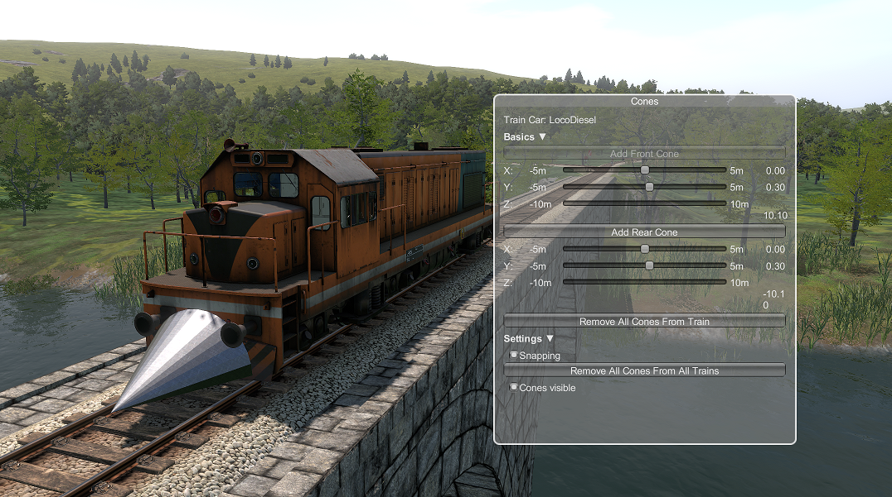

# Derail Valley Cone

A mod for the game [Derail Valley](https://store.steampowered.com/app/588030/Derail_Valley/) that adds a cone to the front or back of your train which forces other train cars to derail and push out the way:

Auto-fitted to any loco. Manually fitted to some trains (DE2 and DH4).

## Install

Download the zip and use Unity Mod Manager to install it.

**Depends on [DerailValleyModToolbar](https://github.com/imagitama/derail-valley-mod-toolbar)**

## How to use

1. Press alt to open the in-game UI
2. Click the cone button in the toolbar
3. Add

## Replacing the cone mesh

1. Create Unity 2019 project
2. Create prefab named whatever
3. Create AssetBundle named "cone" and place into modfolder/Dependencies/AssetBundles

It requires a root-level mesh collider.

## Development

Template from https://github.com/derail-valley-modding/template-umm

Created in VSCode (with C# and C# Dev Kit extensions) and MSBuild.

1. Run `msbuild` in root to build

## Publishing

1. Run `.\package.ps1`
